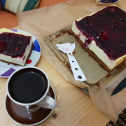
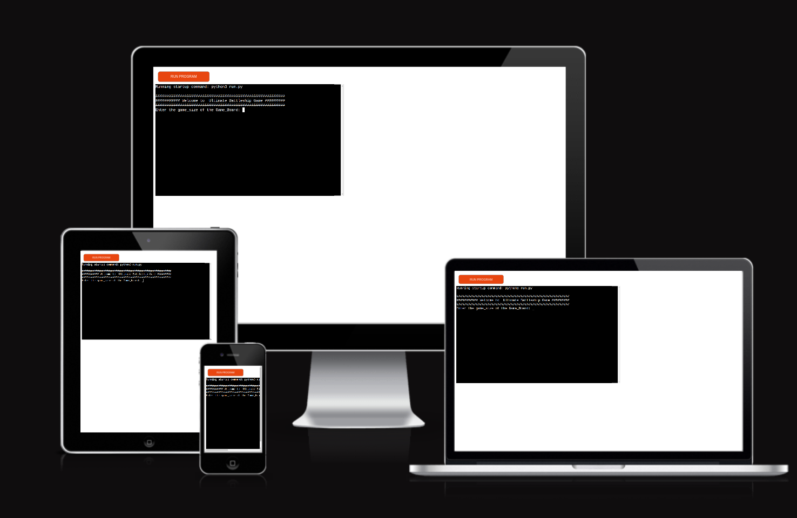

 

# Ultimate Battleship Game

## Welcome

Welcome to the classic game of Battleship! Battleship is a strategic naval combat game where players engage in a thrilling battle of wits on the high seas. In this game, each player commands a fleet of ships hidden on a grid, and the objective is to strategically guess and locate the opponent's ships while concealing the positions of your own. With a combination of cunning tactics and sharp deduction skills, players aim to sink their opponent's entire fleet before theirs meets the same fate. Prepare for an adrenaline-pumping adventure filled with suspense, strategy, and exhilarating naval warfare. Get ready to embark on a voyage of excitement as you challenge your friends or test your skills against the computer in the timeless game of Battleship! However, the game could be played via Python Terminal game.

[Here is the live version of the project](https://love-cake-0ca041934c7d.herokuapp.com/)

## How to Play:

In Battleship, players engage in a strategic naval battle where the objective is to sink the opponent's fleet before they sink yours. The game begins with each player secretly placing their ships on their grid, which is typically a 10x10 board. But in our case, we have the option to enter the game size at the beginning which could start with 2. Once the ships are placed, players take turns guessing the coordinates of their opponent's ships by calling out a row and column on the grid. For example, "B4" would represent the cell in the second row and fourth column. After each guess, the opponent responds with "Hit" if a ship is present at the guessed coordinates, or "Miss" if not. If a hit is confirmed, the player continues guessing until they miss. The game continues until one player successfully sinks all of their opponent's ships. Strategic thinking, deduction, and a bit of luck are key to emerging victorious in this classic game of Battleship.

## Purpose of the project:

The purpose of the Battleship game project is to recreate the classic board game experience in a digital format, providing players with an immersive and entertaining gaming experience. By developing this project, the aim is to offer a platform where players can engage in strategic naval warfare, testing their tactical skills and decision-making abilities. Additionally, the project aims to introduce players to the timeless game of Battleship, fostering nostalgia for those familiar with the game and offering a fun and challenging experience for new players. Through this project, players can enjoy the thrill of competitive gameplay, whether facing off against friends or challenging the computer AI, all while experiencing the excitement of naval battles on the open seas. Ultimately, the purpose of the Battleship game project is to provide an enjoyable and engaging gaming experience that captures the essence of the classic board game while embracing the possibilities of digital technology.

## user stories:
 
User Stories:

1. As a player, I want to be able to set the size of the game board before starting a game of Battleship, so I can customize the gameplay experience according to my preferences.
   
2. As a player, I want to receive feedback on the validity of my guess, so I can adjust my strategy accordingly and make informed decisions during gameplay.

3. As a player, I want to have a visual representation of both my own fleet and the opponent's fleet on the game board, so I can track the progress of the game and plan my next moves strategically.

4. As a player, I want the option to play against the computer AI, so I can enjoy the game even when I don't have someone to play against in person.

5. As a player, I want to receive notifications when I successfully hit and sink an opponent's ship, so I can feel a sense of accomplishment and progress in the game.

6. As a player, I want the game to end and declare a winner once all of the opponent's ships have been sunk, so I can know when the game is over and celebrate my victory.

## Features:

### Exiting Features:

The Battleship game offers a range of exciting features to enhance the gaming experience:

1. Customizable Game Board: Player have the ability to set the size of the game board, allowing for customization and flexibility in gameplay.

2. Real-time Feedback: Player receive immediate feedback on the validity of their guesses, helping them adjust their strategies and make informed decisions during gameplay.

3. Visual Representation: The game provides a visual representation of both the player's fleet and the opponent's fleet on the game board, allowing the player to track his/her progress and plan strategic maneuvers.

4. Single Player: Player can enjoy the game in single-player mode, competing against the computer AI.

5. Hit and Sink Notifications: Players are notified when they successfully hit and sink an opponent's ship, adding to the excitement and sense of achievement as they progress through the game.

6. Realistic Naval Combat Mechanics: The game simulates realistic naval combat mechanics, including ship placement, movement, and engagement, for an immersive and challenging gameplay experience.

7. End-of-Game Declaration: The game ends and declares a winner once all of the opponent's ships have been sunk, providing closure andb allowing players to celebrate their victory.

8. User-friendly Interface: The game features a user-friendly interface with intuitive controls and clear visuals, ensuring a smooth and enjoyable gaming experience for players of all skill levels.
   
9. It offers a possibility to display the remaining ships for both the player and the opponent.

### Future features:

1. As a player, I want the game to simulate realistic naval combat mechanics, such as ship placement, movement, and engagement, to enhance the immersive experience and challenge of the game.

2. As a player, I want the option to play Battleship with friends in a multiplayer mode, so I can compete and strategize against real opponents in real-time. E.i: challenge friends in multiplayer mode for thrilling head-to-head battles.

3. As a player, I want the option that my Ships are vary in size, ranging from a single-cell destroyer to a larger aircraft carrier spanning five cells. 

# Flowchart

# technology

## Getting Started:
To set up the Cake Shop Website locally for development or testing purposes, follow these steps:

Clone this repository to your local machine.
Install dependencies using npm install or yarn install.
Configure environment variables for database connection, payment integration, and other settings (see .env.example).
Run the application using npm start or yarn start.
Access the website via http://localhost:3000 in your web browser.
Contributing:
We welcome contributions from the community to enhance and improve the Cake Shop Website. If you have any ideas, bug fixes, or feature requests, feel free to open an issue or submit a pull request. Please ensure to follow our contribution guidelines for smooth collaboration.

License:
This project is licensed under the MIT License, which means you are free to use, modify, and distribute the code for both personal and commercial purposes. However, we appreciate attribution to the original creators.

## Reminders

- Your code must be placed in the `run.py` file
- Your dependencies must be placed in the `requirements.txt` file
- Do not edit any of the other files or your code may not deploy properly

# Testing:
   ##  code validation

   ##  test cases (user story based with screenshots)

   ## fixed bugs

# Deployment:
##  via code anywhere

##  via heroku

### Creating the Heroku app

    When you create the app, you will need to add two buildpacks from the _Settings_ tab. The ordering is as follows:

    1. `heroku/python`
    2. `heroku/nodejs`

    You must then create a _Config Var_ called `PORT`. Set this to `8000`

    If you have credentials, such as in the Love Sandwiches project, you must create another _Config Var_ called `CREDS` and paste the JSON into the value field.

    Connect your GitHub repository and deploy as normal.

    ## Constraints

    The deployment terminal is set to 80 columns by 24 rows. That means that each line of text needs to be 80 characters or less otherwise it will be wrapped onto a second line.

# credits:

- Some images from the website were sourced from [Pexels](https://www.pexels.com/) and [Unsplash](https://unsplash.com/)
- Images were compressed by [iloveimg.com](https://www.iloveimg.com/de)
- Image optimisation was learned from [Layout, Flywheel](https://getflywheel.com/layout/optimize-images-for-web/#file-type)
- Some of the commands, statement are sourced from the our course from Code Institute.
-  Logo is sourced from [walmart.com](https://www.walmart.com)  

